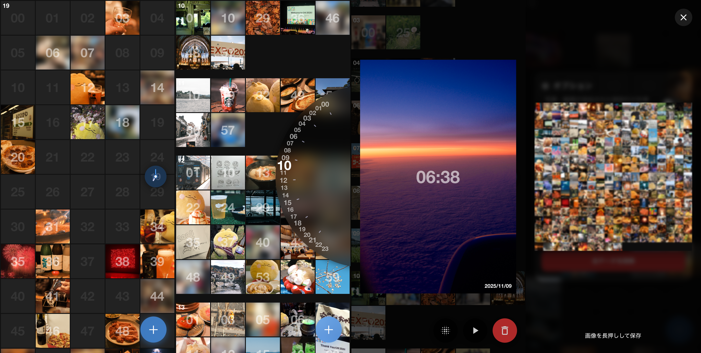

# 1440

60 × 24 = 1440 分のそれぞれの枠に 1 枚ずつお気に入りの写真／動画を記録していく写真管理アプリケーションです。



紹介記事：[1 日 1440 分のそれぞれにお気に入りの 1 枚を記録していく写真管理アプリ（Zenn）](https://zenn.dev/inaniwaudon/articles/810235c935299c)

## 開発

Vite + React の構成をベースとして、Progressive Web Application（PWA）として実装されます。

```sh
yarn
yarn dev     # 開発サーバー
yarn build   # ビルド
yarn deploy  # Cloudflare Workers へデプロイ
yarn format  # Biome で整形
```
